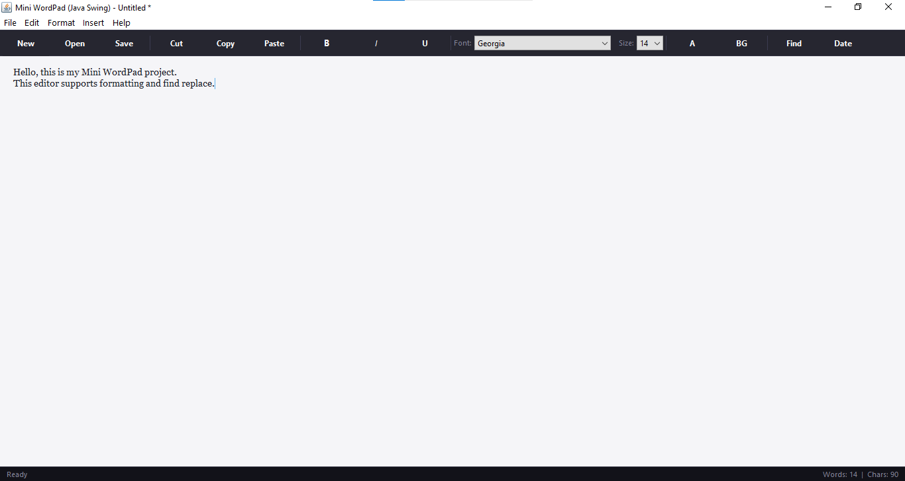

# 📝 Mini WordPad (Java Swing)

A simple and powerful **desktop text editor** built using Java Swing.  
This project demonstrates GUI development, file handling, and text formatting in Java.

---

## 🚀 Features

- 📂 File Operations (New, Open, Save, Save As)
- ✂️ Cut, Copy, Paste
- 🔍 Find & Replace
- 🎨 Text Formatting (Bold, Italic, Underline)
- 🎯 Font Family & Size Selection
- 🌈 Text & Background Color Change
- 📊 Word Count
- 🕒 Insert Date & Time
- 🖥️ Clean GUI

---

## 📸 Screenshots



---

## 🛠️ Technologies Used

- Java
- Java Swing
- AWT
- File Handling (I/O Streams)

---

## ⚙️ How to Run

1. Clone the repository:
```bash
git clone https://github.com/your-username/Mini-WordPad-Java.git